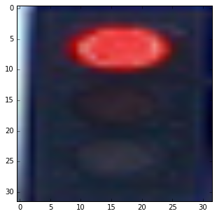
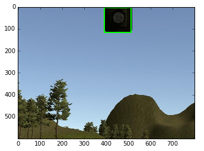
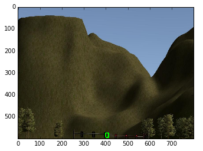
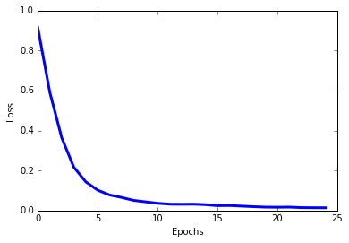
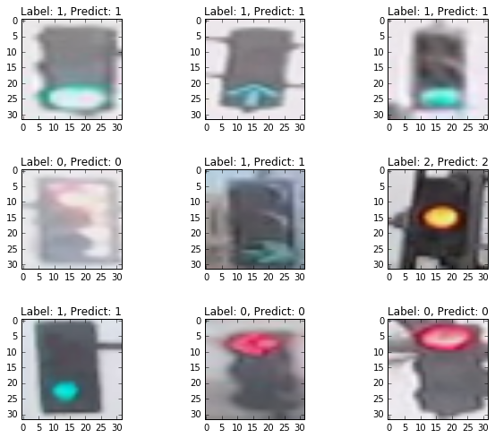

# Traffic Light Detection and Classification

## Overview
As part of the efforts for Udacity SDC final project(https://github.com/SiliconCar/CarND-Capstone), we take a two-stage deep learning based approach in traffic light classification. That is, the traffic light detection module consists of two CNN based models in tandem: traffic light detection (localization) and (light) color classification.

###Traffic Light Detection

Traffic light detection takes a captured image as input and produces the bounding boxes as the output to be fed into the classification model. We use TensorFlow Object Detection API, which is an open source framework built on top of TensorFlow to construct, train and deploy object detection models. The Object Detection API also comes with a collection of detection models pre-trained on the COCO dataset that are well suited for fast prototyping. Specifically, we use a lightweight model: ```ssd_mobilenet_v1_coco``` that is based on Single Shot Multibox Detection (SSD) framework with minimal modification.  Though this is a general-purpose detection model (not optimized specifically for traffic light detection), we find this model sufficiently met our needs, achieving the balance between good bounding box accuracy (as shown in the following figure) and fast running time.


###Traffic Light Classification

After locating the bounding box for the traffic light, we crop the image to only include the traffic light, resize it to 32x32, and pass this along to the object classification step, as shown in the following figure.

[//]:#


We use a simple CNN for our classification. It consists of three convolutional layer with (3x3 kernel), the last two of which are followed by a max_pooling layer, a flatten layer, and two fully connected layers. 


## Implementation 

### Traffic Light Detection
The COCO dataset contains images of 90 classes ranging from bird to baseball bat. The first 14 classes are all related to transportation, including bicycle, car, and bus, etc. The ID for traffic light is 10. 

```
item {
  name: "/m/01g317"
  id: 1
  display_name: "person"
}
item {
  name: "/m/0199g"
  id: 2
  display_name: "bicycle"
}
item {
  name: "/m/0k4j"
  id: 3
  display_name: "car"
}
:
:
item {
  name: "/m/015qff"
  id: 10
  display_name: "traffic light"
}
:
:
```
For the classes included in COCO dataset, please see mscoco\_label\_map.pbtxt, genarally located in 
```
${PYTHON_DIRECTORY}$/site-packages/tensorflow/models/object_detection/data
```

The traffic-light detection is implemented in 
```
get_localization(self, image, visual=False) 
```
member function of the TLClassifier class, in tl\_detection\_classification_test.py. The following boiler plate code are used to initialize tensorflow graph and model

```
detect_model_name = 'ssd_mobilenet_v1_coco_11_06_2017'
PATH_TO_CKPT = detect_model_name + '/frozen_inference_graph.pb'
# setup tensorflow graph
self.detection_graph = tf.Graph()
    
# configuration for possible GPU use
config = tf.ConfigProto()
config.gpu_options.allow_growth = True
# load frozen tensorflow detection model and initialize 
# the tensorflow graph
with self.detection_graph.as_default():
    od_graph_def = tf.GraphDef()
    with tf.gfile.GFile(PATH_TO_CKPT, 'rb') as fid:
       serialized_graph = fid.read()
       od_graph_def.ParseFromString(serialized_graph)
       tf.import_graph_def(od_graph_def, name='')
       self.sess = tf.Session(graph=self.detection_graph, config=config)
       self.image_tensor = self.detection_graph.get_tensor_by_name('image_tensor:0')
       # Each box represents a part of the image where a particular object was detected.
        self.boxes = self.detection_graph.get_tensor_by_name('detection_boxes:0')
       # Each score represent how level of confidence for each of the objects.
       # Score is shown on the result image, together with the class label.
        self.scores =self.detection_graph.get_tensor_by_name('detection_scores:0')
        self.classes = self.detection_graph.get_tensor_by_name('detection_classes:0')
        self.num_detections =self.detection_graph.get_tensor_by_name('num_detections:0')

```
The actual detection is carrried out by 

```
(boxes, scores, classes, num_detections) = self.sess.run(
                  [self.boxes, self.scores, self.classes, self.num_detections],
                  feed_dict={self.image_tensor: image_expanded})
```

There could be multiple detections of traffic light in an image, here, I select the first occurence of the detection, i.e., the one with the highest confidence.
```
idx = next((i for i, v in enumerate(cls) if v == 10.), None)
```
To avoid false-positive, I select a confidence threshold and reject any detection that is lower than this threshold. In case that this threshold by itself can not prevent false-positive in some corner cases (as shown in the figure below), I also set the box size and height-to-width ratio thresholds.




### Traffic Light Classification
The training and evaluation of the classifier is implemented in /traffic\_light\_detection/traffic\_light\_classification\_detection/traffic\_light\_classification.py
The CNN architecture for the classifier is shown in the following:

 
 
For training images, we use a combination of web scraping, simulator image capturing, and ROSbag image capturing. We use Keras (with Tensorflow as backend) for training with a total of 2,000 images (10% of which are used as validation/test samples). Except for the scaling (by the value of 255), we do not use other image augmentation techniques. We trained for 25 epochs and can achieve >99% validation/test accuracy, as shown in the following figures.




We save the model into the .h5 file to be used in the two-stage approach.